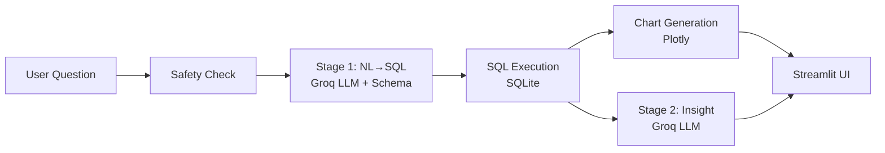

# BI Agent — AI-Powered Business Intelligence

**Live demo:** [https://gakshay11-bi-agent.streamlit.app](https://gakshay11-bi-agent.streamlit.app)

A conversational AI agent for Finance/Sales analytics. Ask business questions in plain English — get SQL, charts, and insights instantly.

---

## What It Does

- Converts natural language to SQL against a Finance/Sales Pipeline database
- Auto-generates the right chart type based on data shape
- Produces AI-powered business insight on every result
- Maintains conversational context across multiple questions

---

## Demo Questions

- What is our revenue vs target by region?
- Who are the top 5 reps by closed deal value?
- Where are we over budget this quarter?
- Show the monthly revenue trend
- What is the win rate by sales team?
- Which product has the highest margin?

---

## Architecture



---

## Stack

| Component | Technology |
|---|---|
| LLM backend | Groq — llama-3.3-70b-versatile |
| LLM wrapper | LangChain (thin layer) |
| Database | SQLite |
| Chart generation | Plotly |
| UI | Streamlit |
| Data generation | Faker |
| Testing | pytest |

---

## Key Technical Decisions

- **Schema-agnostic:** Agent reads DB schema at runtime via PRAGMA queries with hash-based cache invalidation — not hardcoded
- **Two-stage pipeline:** SQL generation (Stage 1) is a dedicated LLM call, separate from insight generation (Stage 2). Keeps failure modes isolated and debuggable
- **Fixed pipeline over LLM routing:** Evaluated LLM-routed tool-calling, chose fixed sequential pipeline for reliability — chart type selection is deterministic data-shape logic, not an LLM decision
- **Sliding window memory:** Keeps last 6 messages only — prevents silent context window overflow on long conversations
- **Data-anchored time context:** "This quarter" resolves to the latest quarter in the dataset, not the system clock — ensures answers stay meaningful on a static dataset

---

## Known Limitations

- Memory resolves scalar references (a region, a quarter) reliably. Sets of named entities ("those 5 reps") are not reliably scoped in follow-up questions
- Dataset covers 9 quarters (2024-Q3 to 2026-Q3). First and last quarters are partial periods — trend charts will show lower values at the edges

---

## Setup

```bash
git clone https://github.com/your-username/p3-bi-agent
cd p3-bi-agent
python -m venv venv
venv\Scripts\activate  # Windows
pip install -r requirements.txt
python data/generate_data.py
streamlit run app.py
```

Add a `.env` file:
GROQ_API_KEY=your_key_here
MODEL_SQL=llama-3.3-70b-versatile
MODEL_FALLBACK=llama-3.1-8b-instant
DB_PATH=data/finance_sales.db
---

## Tests

```bash
pytest tests/ -v
```

24 tests — unit + integration covering schema inspector, SQL execution, safety checks, chart detection, and end-to-end pipeline.